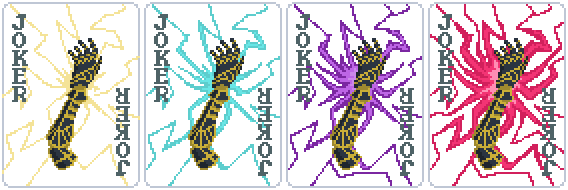
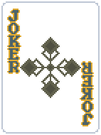
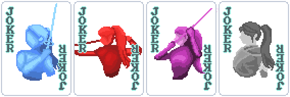
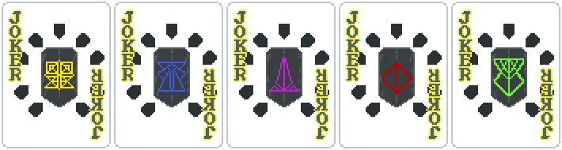
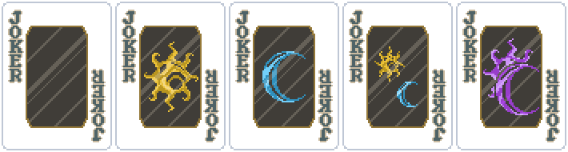
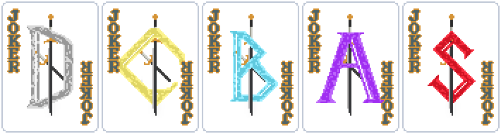

# Balatro - Expedition 33

## About

A mod for Balatro which adds Expedition 33-inspired Jokers.

## Content

### Jokers

- [**Overcharge**](#overcharge) (*Gustave*)
- [**Elemental Stains**](#elemental-stains) (*Lune*)
- [**Battle Stance**](#battle-stance) (*Maelle*)
- [**Bestial Wheel**](#bestial-wheel) (*Monoco*)
- [**Sun and Moon**](#sun-and-moon) (*Sciel*)
- [**Perfection**](#perfection) (*Verso*)

#### Overcharge

**Rarity:** Common

**Cost:** $4

Each played card gives +1 Charge. Charges are reset at
the end of the blind. The Joker gives X Mult to the hand
depending on the amount of Charges. Just like the game,
there are "damage" thresholds based on the amount of
Charges.

| Damage  | Charges Range | Mult |
| :-----: | :-----------: | :--: |
| Low     | 0-3           | X1.1 |
| Medium  | 4-6           | X1.3 |
| High    | 7-9           | X1.6 |
| Extreme | 10            | X2.0 |

#### Elemental Stains

**Rarity:** Common

**Cost:** $4

Each scored card has its Chips boosted based on the
amount of Stains active for its Suit. Each Suit
generates a specific Elemental Stain. There are five
elements: Ice, Fire, Lightning, Earth and Light. Light
is generated when all four base Stains are active and
any card is scored. You can have at most four Stains
active at any given time. Stains are reset at the end
of the Blind.

| Stain     | Suit     | Chips  |
| :-------: | :------: | :----: |
| Ice       | Diamonds | +X0.25 |
| Fire      | Hearts   | +X0.25 |
| Lightning | Spades   | +X0.25 |
| Earth     | Clubs    | +X0.25 |
| Light     | All      | +X0.5  |

*The multiplier is additive.*

#### Battle Stance

**Rarity:** Uncommon

**Cost:** $6

The Joker begins in Stanceless mode. Stances change when
playing certain types of hands which can be viewed in the
"Poker Hands" tab. Playing an hand that changes to the
same Stance as the current one changes back to Stanceless
mode. Stance resets at the end of the blind.

| Stance    | On Play     | On Discard |
| :-------: | :---------: | :--------: |
| Defensive | X1.25 Chips |            |
| Offensive | X1.75 Mult  | -$3        |
| Virtuose  | X2 Mult     |            |

#### Bestial Wheel

**Rarity:** Uncommon

**Cost:** $6

There are five Masks, each Mask boosts by X2 Mult a
specific Poker Hand which can be viewed in the "Poker
Hands" tab. The Almighty Mask boosts all Poker Hands
while giving an X3 Mult to its specific Hand types. The
Masks rotate between Caster, Agile, Balanced, Heavy and
Almighty. The rotation is calculated by the rank of the
left-most scored card at the end of the Play.

#### Sun and Moon

**Rarity:** Uncommon

**Cost:** $6

Creates Sun and Moon Charges for each played scoring
card with light and dark Suits respectively. If both
Sun and Moon Charges are active at the start of the
turn, they are consumed and Twilight begins. Twilight
gives Mult for each consumed Charge. You cannot create
Charges while in Twilight and they are reset when it
ends. The Joker resets at the end of the Blind.

| Suit     | Charge |
| :------: | :----: |
| Diamonds | Sun    |
| Hearts   | Sun    |
| Spades   | Moon   |
| Clubs    | Moon   |

Twilight lasts 2 turns and gives +X0.2 Mult for each
Charge consumed.

#### Perfection

**Rarity:** Uncommon

**Cost:** $6

Each scored card gives 1 Perfection, while each
discarded card removes 1 Perfection. Perfection
resets each Ante. There are five Ranks of
perfection (D, C, B, A, S) which give a different
X Mult to the hand.

| Rank | Perfection Range | Mult |
| :--: | :--------------: | :--: |
| D    | 0-2              | X1   |
| C    | 3-7              | X1.1 |
| B    | 8-14             | X1.3 |
| A    | 15-29            | X1.6 |
| S    | 30               | X2   |

## Installation

Make sure to have [Steamodded](https://github.com/Steamodded/smods/wiki)
installed.

Download the mod and place it in `%APPDATA%\Balatro\Mods`. You
should either have an `Expedition33` folder or an archive
(`Expedition33.zip`) which contains the source of the mod.
It shouldn't be necessary to extract the archive, Steamodded can
handle it for you (at least on recent versions).

## Credits

Thanks to [Elenith](https://www.nexusmods.com/profile/Elenith04)
which came up with the idea to create a mod together, made
all the assets and translations, gave feedback and helped
designing the gameplay mechanics of the Jokers, and for
testing everything.

Obviously a big thank you to **Sandfall Interactive** for making
**Clair Obscur: Expedition 33** and giving us a masterpiece.
